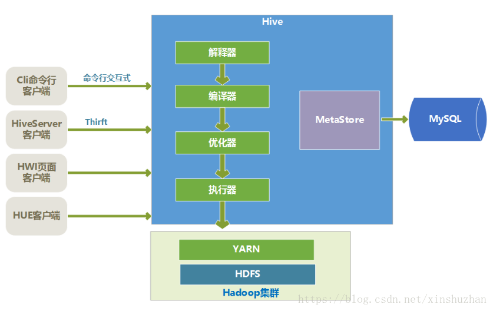

## 1. 常用大数据服务

 ——以ambari为例

### 1.1 Hdfs

  **Hadoop Distributed File System**，分布式文件系统。

  Hadoop 使用hdfs来连接一些普通个人计算机（称为节点），这些节点包含在其上分布着大量数据块的多个集群中。通过 MapReduce 处理模型，可以将那些数据块作为一个无缝文件系统进行访问和存储。

  **架构图**：


  **主要特点**：

- 容错性

  可以自动移除故障的节点，确保系统正确运行；

- 对大数据集的高吞吐量访问

- 将处理逻辑放置到数据附近通常比将数据移向应用程序空间更好

**通信协议**：

​	所有 HDFS 通信协议都构建于 TCP/IP 协议之上。HDFS 客户端连接到 Name node 上打开的一个 Transmission Control Protocol (TCP) 端口，然后使用一个基于 Remote Procedure Call (RPC) 的专有协议与 Name node 通信。 Data node 使用一个基于块的专有协议与 Name node 通信。

**重要名词**：

- Name Node

  集群中一般只有一个namenode（HA下会有两个），用于管理文件系统中的文件，它知道一个文件被分成了多少块，每一块在哪个datanode上。

- Data Node

  负责存储和管理数据块，并和namenode交互。

- Block

  数据块，大文件会被分割成多个block进行存储，block大小默认为64MB。每一个block会在多个datanode上存储多份副本，默认是3份。

**参考资料**：

​	a. [Hadoop Distributed File System 简介](https://www.ibm.com/developerworks/cn/web/wa-introhdfs/)

​	b. [HDFS文件的读写操作理论解析](https://blog.csdn.net/a1b2c3d4123456/article/details/46766903)

### 1.2 Hadoop

  一个适合大数据的分布式存储与计算平台。可运行于一般的商用服务器上，具有高容错、高可靠性、高扩展性等特点。

**使用场景**：

- 适用场景

  大规模数据，流式数据（一次写、多次读）。

- 不适用场景

  低时延的数据访问，大量的小文件，频繁修改文件。

**架构**：


​	others是利用YARN的资源管理功能实现其他的数据处理方式。

  **生态环境**：


  **参考资料**：

​	a. [Hadoop 简介](https://www.w3cschool.cn/hadoop/fgr61jyf.html)

​	b. [Hadoop日记Day1---Hadoop介绍](https://www.cnblogs.com/sunddenly/p/3977011.html)

### 1.3 Hbase


### 1.4 Hive

一个可以使用 sql 来读写和管理大型分布式数据集的数据库。

#### 1.4.1 特点

- 通过类 SQL 来分析大数据，避免了写 MapReduce 程序来分析数据，使得分析数据更容易；
- 数据是存储在 HDFS 上的，Hive 本身并不提供数据的存储功能；
- Hive 是将数据映射成数据库和一张张的表，库和表的元数据信息一般存在关系型数据库上（比如MySQL）；
- 数据存储方面，可以存储很大的数据集，并且对数据完整性、格式要求并不严格；
- 数据处理方面，因为 Hive 语句最终会生成 MapReduce 任务去计算，所以不适用于实时计算的场景，适用于离线分析。

#### 1.4.2 架构



#### 1.4.3 核心

Hive 的核心是驱动引擎，驱动引擎由四部分组成：

- 解释器：解释器的作用是将HiveSQL语句转换为语法树（AST）；
- 编译器：编译器是将语法树编译为逻辑执行计划；
- 优化器：优化器是对逻辑执行计划进行优化；
- 执行器：执行器是调用底层的运行框架执行逻辑执行计划；

#### 1.4.4 客户端

Hive有很多种客户端。

- **cli 命令行客户端**

  采用交互窗口，用hive命令行和Hive进行通信。

- **HiveServer2 客户端**

  用Thrift协议进行通信，Thrift是不同语言之间的转换器，是连接不同语言程序间的协议，通过JDBC或者ODBC去访问Hive。

- **HWI 客户端**

  hive自带的一个客户端，但是比较粗糙，一般不用。

- **HUE 客户端**

  通过Web页面来和Hive进行交互，使用的比较多。

**参考资料**：

​	a. [大数据离线分析工具Hive简单介绍](https://blog.csdn.net/xinshuzhan/article/details/80382153)

### 1.5 Yarn

​	新一代Hadoop计算平台，将资源管理和处理组件分开，集成在Hadoop2.0中。

### 1.6 Spark

一个内存计算框架。

#### 1.6.1 常用算子

- **flatMap**

  用法：

  ​	遍历一个列表对里面单个对象进行处理，返回 0 个或多个处理后的对象。一般用于对原始数据的处理，过滤掉无效的数据。

  代码示例：

  ```java
  Dataset<Row> dsResult = queryData(sc).distinct();
  // 函数调用
  JavaPairRDD<String, Person> javaPairRDD =
    dsResult.toJavaRDD().flatMapToPair(new OriginPairFlatMap());
  
  public class OriginPairFlatMap
      implements org.apache.spark.api.java.function.PairFlatMapFunction<
          Tuple2<String, List<Person>>, Tuple2<String, List<Person>>> {
  
    @Override
    public Iterator<Tuple2<String, List<Person>>> call(Tuple2<String, List<Person>> tuple) {
      List<Tuple2<String, List<Person>>> results = Lists.newArrayList();
  
      List<Person> persons = tuple._2;
      // 写自己的业务逻辑 ...
  
      return results.iterator();
    }
  }
  ```

- **combineByKey**

  用法：

  ​	根据 key 将 rdd 中的数据进行分组，可以在数据分组过程中控制集合的大小，避免异常数据导致程序崩溃。比如对通话数据进行分析时，10086 等特殊号码就可能导致集合过大，executor 的内存不够用，程序崩溃。

  代码示例：

  ```java
  // 函数调用
  JavaPairRDD<String, List<Person>> combinedRDD =
    javaPairRDD.combineByKey(
      CombineByKeyFunction.createCombinerFunction(),
      CombineByKeyFunction.createMergeValueFunction(groupThreshold),
      CombineByKeyFunction.createMergecombinerFunction(groupThreshold));
  
  public class CombineByKeyFunction {
  
    // 第一个函数，创建集合，即第一次碰到这个 key 的数据时
    public static Function<Person, List<Person>> createCombinerFunction() {
      return value -> Lists.newArrayList(value);
    }
  
    // 第二个函数，把再次碰到的这个 key 的数据放到已有的集合里
    public static Function2<List<Person>, Person, List<Person>> createMergeValueFunction(
        int threshold) {
      return (lstValues, value) -> {
        if (lstValues.size() < threshold) {
          lstValues.add(value);
        }
        return lstValues;
      };
    }
  
    // 第三个函数，合并属于同一个 key ，但是在不同分区中的数据
    public static Function2<List<Person>, List<Person>, List<Person>> createMergecombinerFunction(
        int threshold) {
      return (allvalues, values) -> {
        if (allvalues.size() + values.size() <= threshold) {
          allvalues.addAll(values);
        }
        return allvalues;
      };
    }
  }
  ```

#### 1.6.2 一些技巧

- **减少分区个数，加速程序运行**

  如果分区过多，可能导致大部分时间都在起任务，而真正执行任务的时间却是很短的。

  可以通过函数：**coalesce(numPartitions,shuffle)** 来调整分区的个数，加快程序的执行。

- **打印任务执行时的 GC 情况**

  修改 conf/spark-env.sh ，加上：-verbose:gc -XX:+PrintGCDetails -XX:+PrintGCTimeStamps

- **缓存 RDD**

  什么时候需要缓存 rdd ？当集群花了很多时间进行垃圾回收时。

  缓存的时候有3个级别：

  - MEMORY_ONLY，只存储在内存中，集群的默认值
  - MEMORY_AND_DISK，先存储在内存里面，存不下的就存到磁盘
  - DISK_ONLY，不管内存是否存得下都存放到磁盘

  通过 persist 函数可以设置存储级别缓存 rdd，cache 函数使用默认的存储级别缓存 rdd 。

- **序列化**

  spark 在缓存 rdd 时使用的是 java 默认的序列化方式，这种比较慢。KyroSerializer 这种序列化方式，比 java 默认的更快并且占用的内存更少。

### 1.7 Kafka


### 1.8 MapReduce


### 1.9 Tez

​	运行在 yarn 之上，支持 DAG 作业的计算框架。核心思想是将 Map 和 Reduce 两个操作进一步拆分，Map 被拆分成 input,processor,sort,merge 和 output，Reduce 被拆分成 input,shuffle,sort,merge,processor 和output 等，这些分解后的元操作可以任意灵活组合，产生新的操作，经过一些控制程序组装后，可形成一个大的DAG 作业。

### 1.10 Pig


### 1.11 ZooKeeper


### 1.12 Ambari Metricks


### 1.13 Knox


### 1.14 Slider


## 2. 常见问题

### 2.1 Hbase为什么适合做实时查询

​	 HBase能提供实时计算服务主要原因是由其架构和底层的数据结构决定的，即由 LSM-Tree(Log-Structured Merge-Tree) + HTable(region分区) + Cache 决定。客户端可以直接定位到要查数据所在的 HRegion server 服务器，然后直接在服务器的一个region上查找要匹配的数据，并且这些数据部分是经过 cache 缓存的。 

​	同时，hbase 中的数据是以 key,value 的形式进行组织的，可以通过 key 快速获得 value ，类似 hash map ，故适合做实时查询。

**hbase 数据查询流程**：

​	1）HBase 读取首先会在缓存（BlockCache）中查找，采用了 LRU（最近最少使用算法）；

​	2）如果缓存中没找到，会从内存中的 MemStore 中查找；

​	3）只有这两个地方都找不到时，才会加载 HFile 中的内容；

###  2.2 Hive为什么适合做离线计算

​	hive 中的数据组织形式和传统关系型数据库类似，分多行多列，并且支持大多数 sql 语法，可以根据条件筛选出特定数据进行计算和分析。Hive 语句最终会生成 MapReduce 任务去计算，所以不适用于实时计算的场景，故适合做离线计算。

### 2.3 Hdfs 的“一次写入、多次读取”是什么意思

​	hdfs采用的是流式数据处理，只能一次写入，不可以修改，可以多次读取。