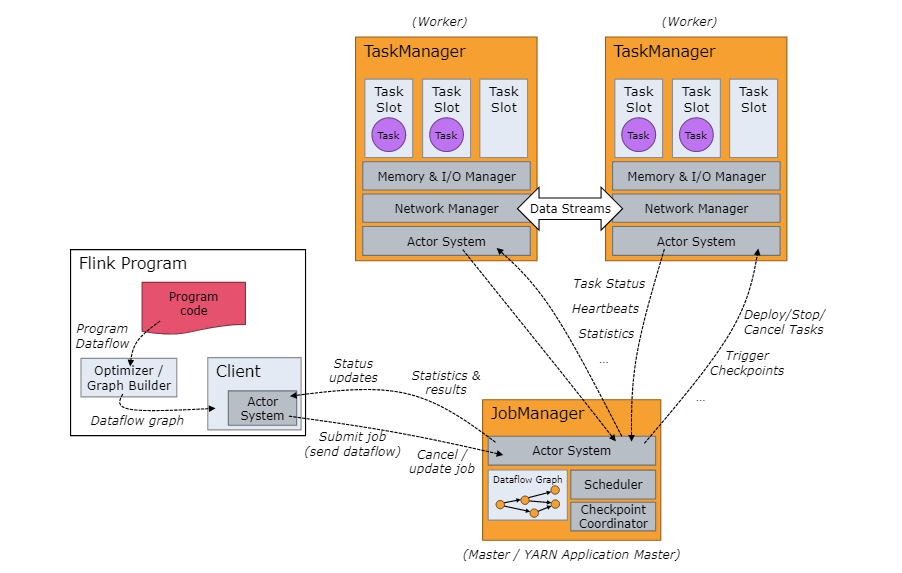

# 1.简介

> Apache Flink is a framework and distributed processing engine for stateful computations over *unbounded and bounded* data streams. 

Apache Flink是一个用于在无界和有界数据流上进行有状态的**计算的框架**和**分布式处理引擎**。

Flink 需要计算资源来执行应用程序，集成了常见的集群资源管理器。例如 Hadoop YARN、 Apache Mesos和 Kubernetes，但同时也可以作为独立集群运行。

# 2.名词解释

- **unbounded data stream**，无界数据流

  定义了流的开始，但没有定义流的结束。此种数据必须持续处理，并即时产生相应的输出。例如，某系统的操作日志，实时处理日志的现实意义在于可以及时发现 违规操作或者可疑操作，从而产生告警。

- **bounded data stream**，有界数据流

  既定义了流的开始，也定义了流的结束。有界流可以在采集所有数据后再进行计算，这种处理方式通常被称为批处理。例如，某系统管理员定时导入上个季度的经营数据。

- **state**，状态

  只有在每一个单独的事件上进行转换操作的应用才不需要状态，换言之，每一个具有一定复杂度的流处理应用都是有状态的。任何运行一定业务逻辑的流处理应用都需要在一定时间内存储所接收的事件或中间结果，以供后续的某个时间点进行访问并进行后续处理

- **job manager**

  The *JobManager* has a number of responsibilities related to coordinating the distributed execution of Flink Applications: it decides when to schedule the next task (or set of tasks), reacts to finished tasks or execution failures, coordinates checkpoints, and coordinates recovery on failures, among others. 

- **task manager**

  The *TaskManagers* (also called *workers*) execute the tasks of a dataflow, and buffer and exchange the data streams.

  There must always be at least one TaskManager.

- **task slot**

  The smallest unit of resource scheduling in a TaskManager is a task *slot*. The number of task slots in a TaskManager indicates the number of concurrent processing tasks. 

  Each worker (TaskManager) is a *JVM process*, and may execute one or more subtasks in separate threads. To control how many tasks a TaskManager accepts, it has so called **task slots** (at least one).

- **flink master**

  

# 3.架构设计

下面是 Task Manager的结构图：

# 4.特性

**应用状态特性**：

- **多种状态基础类型**

  Flink 为多种不同的数据结构提供了相对应的状态基础类型，例如原子值（value），列表（list）以及映射（map）。

  开发者可以基于处理函数对状态的访问方式，选择最高效、最适合的状态基础类型。

- **插件化的 State Backend**

  State Backend 负责管理应用程序状态，并在需要的时候进行 checkpoint。

  Flink 支持多种 state backend，可以将状态存在内存或者 RocksDB（一种高效的嵌入式、持久化键值存储引擎）。Flink 也支持插件式的自定义 state backend 进行状态存储。

- **精确一次语义**

  Flink 的 checkpoint 和故障恢复算法保证了故障发生后应用状态的一致性。

- **超大数据量状态**

  Flink 能够利用其异步以及增量式的 checkpoint算法，存储 TB级别的应用状态。

- **可弹性伸缩的应用**

  Flink 能够通过在更多或更少的工作节点上对状态进行重新分布，支持有状态应用的分布式横向伸缩。

**时间语义特性**：

- **事件时间模式**

  使用事件时间语义的流处理应用根据事件本身自带的时间戳进行结果的计算。因此，无论处理的是历史记录的事件还是实时的事件，事件时间模式的处理总能保证结果的准确性和一致性。

- **Watermark支持**

  Flink 引入了 watermark 的概念，用以衡量事件时间进展。Watermark 也是一种平衡处理延时和完整性的灵活机制。

- **迟到数据处理**

  当以带有 watermark的事件时间模式处理数据流时，在计算完成之后仍会有相关数据到达。这样的事件被称为**迟到事件**。

  Flink 提供了多种处理迟到数据的选项，例如将这些数据重定向到旁路输出（side output）或者更新之前完成计算的结果。

- **处理时间模式**

  除了事件时间模式，Flink 还支持处理时间语义。处理时间模式根据处理引擎的机器时钟触发计算，一般适用于有着严格的低延迟需求，并且能够容忍近似结果的流处理应用。

**API特性**：

- **有状态的事件驱动应用**

  ProcessFunction是 Flink 所提供的最具表达力的接口，可以处理一或两条输入数据流中的单个事件或者归入一个特定窗口内的多个事件，可以对时间和状态进行细粒度的控制。

  开发者可以在其中任意地修改状态，也能够注册定时器用以在未来的某一时刻触发回调函数，用于实现基于单个事件的复杂业务逻辑。

- **流批数据处理**

  DataStream API为流处理提供了 窗口、逐条记录的转换和处理事件时进行外部数据库查询等操作。支持 Java和 Scala语言，预先定义了例如`map()`、`reduce()`、`aggregate()` 等函数。开发者可以通过扩展实现预定义接口或使用 Java、Scala 的 lambda 表达式实现自定义的函数。

- **高级分析 API**

  Flink 支持两种关系型的 API，SQL 和 Table API。

**扩展库**：

- **复杂事件处理(CEP)**

  模式检测是事件流处理中的一个常见用例。CEP 库提供了 API，使用户能够以例如正则表达式或状态机的方式指定事件模式。

  CEP 库基于 DataStream API 实现，其应用包括网络入侵检测，业务流程监控和欺诈检测等。

- **DataSet API**

  DataSet API 是 Flink 用于批处理应用程序的核心 API，提供的基础算子包括*map*、*reduce*、*(outer) join*、*co-group*、*iterate*等。

- **Gelly**

  一个基于 DataSet API实现的可扩展的图形处理和分析库。

  Gelly 提供了 label propagation、triangle enumeration 和 page rank 等算法，也提供了一个简化自定义图算法实现的 Graph API。

进度：https://flink.apache.org/zh/flink-applications.html

# 参考资料

[Flink官方指引](https://flink.apache.org/zh/flink-architecture.html)

[Flink Architecture](https://nightlies.apache.org/flink/flink-docs-release-1.14/docs/concepts/flink-architecture/)

